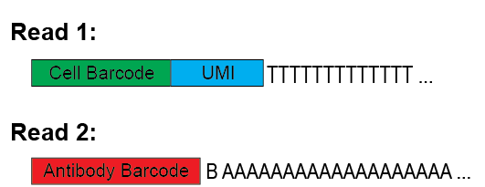

Introduction
---------------------
`CITE-seq-Count` is a program that outputs umi and read counts from raq fastq CITE-seq or hashing data.


How to use it
---------------------

TLDR:

`CITE-seq-count -R1 TAGS_R1.fastq.gz -R2 TAGS_R2.fastq.gz -t TAG_LIST.csv -cbf X1 -cbl X2 -umif Y1 -umil Y2 -cells EXPECTED_CELLS -o OUTFOLDER`

The script is going to count the number of UMIs and reads mapping to an antiobdy from your CITE-Seq experiment.

Here is an image explaining the expected structure of read1 and read2 from the sequencer.



Options
--------------------------
You can find a description of each option bellow.

### INPUT

* [Required] Read1 fastq file location in fastq.gz format. Read 1 typically contains Cell barcode and UMI.

`-R1 READ1_PATH.fastq.gz, --read1 READ1_PATH.fastq.gz`


* [Required] Read2 fastq file location in fastq.gz. Read 2 typically contains the Antibody barcode.

`-R2 READ2_PATH.fastq.gz, --read2 READ2_PATH.fastq.gz`


* [Required] The path to the csv file containing the antibody barcodes as well as their respective names.
You can run tags of different length together.

`-t tags.csv, --tags tags.csv`


### Antibody barcodes structure:
```                        
ATGCGA,First_tag_name
GTCATG,Second_tag_name
GCTAGTCGTACGA,Third_tag_name
GCTAGGTGTCGTA,Forth_tag_name
```

*IMPORTANT*: You need to provide only the variable region of the TAG in the tags.csv. Please refer to the following examples.

* CASE1: Legacy barcodes.
If you are using barcoes that have a T, C or G plus a polyA tail at the end, the tags.csv file should not contain those additions.
Expected barcode:
```
GCTAGTCGTACGA T AAAAAAAAAA
GCTAGTCGTACGA C AAAAAAAAAA
GCTAGTCGTACGA G AAAAAAAAAA
GCTGTCAGCATAC T AAAAAAAAAA
GCTGTCAGCATAC C AAAAAAAAAA
GCTGTCAGCATAC G AAAAAAAAAA
```
The tags.csv should only contain the part before the `T`
```                        
GCTAGTCGTACGA,tag1
GCTGTCAGCATAC,tag2
```

* CASE2: Constant sequences.
If you are using barcoes that have a constant sequence at the end or at the start, the tags.csv file should only contain the variable part.
You should also use the `-trim` `--start-trim` option to tell `CITE-seq-Count` where the variable part of the barcode starts
Expected barcode:
```
CGTAGTCGTAGCTA GCTAGTCGTACGA GCTAGCTGACT
CGTAGTCGTAGCTA AACGTAGCTATGT GCTAGCTGACT
CGTAGTCGTAGCTA GCTAGCATATCAG GCTAGCTGACT
```
The tags.csv should only contain the variable parts and use `-trim 14` to trim the first 14 bases.
```                        
GCTAGTCGTACGA,tag1
AACGTAGCTATGT,tag2
GCTAGCATATCAG,tag3
```


### BARCODING

Positions of the cellular and UMI barcodes.

* [Required] First nucleotide of cell barcode in read 1. For Drop-seq and 10x Genomics this is typically 1.

`-cbf CB_FIRST, --cell_barcode_first_base CB_FIRST`


* [Required] Last nucleotide of the cell barcode in read 1. For 10x Genomics this is typically 16. For Drop-seq this depends on the bead configuration, typically 12.

`-cbl CB_LAST, --cell_barcode_last_base CB_LAST`


* [Required] First nucleotide of the UMI in read 1. For 10x Genomics this is typically 17. For Drop-seq this is typically 13.

`-umif UMI_FIRST, --umi_first_base UMI_FIRST`


* [Required] Last nucleotide of the UMI in read 1. For 10x Genomics this is typically 26. For Drop-seq this is typically 20.

`-umil UMI_LAST, --umi_last_base UMI_LAST`

Example:
Barcodes from 1 to 16 and UMI from 17 to 26, then this is the input you need:

`-cbf 1 -cbl 16 -umif 17 -umil 26`


* [Optional] How many errors are allowed between two cell barcodes to collapse them onto one cell.

`--bc_collapsing_dist N_ERRORS`, default `1`


* [Optional] How many errors are allowed between two umi within the same cell and TAG to collapse.

`--umi_collapsing_dist N_ERRORS`, default `2`


### FILTERING


Filtering for structure of the antibody barcode as well as maximum errors.

* [OPTIONAL] Maximum Levenshtein distance allowed. This allows to catch antibody barcodes that might have `--max-error` errors compared to the real barcodes.

`--max-error MAX_ERROR`, default `3`

Example:

If we have this kind of antibody barcode:

`ATGCCAG`

The script will be looking for ATGCCAG in R2

A `MAX_ERROR` of 1 will allow barcodes such as `ATGTCAG`, having one mismatch to be counted as valid.

There is a sanity check when for the `MAX_ERROR` value chosen to be sure you are not allowing too many mismatches and confuse your antibody barcodes. Mismatches on cell or UMI barcodes are discarded.

* [Optional] How many bases should we trim before starting to map. See `CASE2` of special examples in the

`-trim N_BASES, --start-trim N_BASES`, default `0`


### OUTPUT
You have to choose either the number of cells you expect or give it a list of cell barcodes to retrieve.

* [Required] Number of expected cells from your run. This will reduce the size of the output matrix. It will be used for cell barcode correction as well.

`-cells CELLS, --expected_cells CELLS`

* [Optional] If you have a whitelist of barcodes produced by the cDNA data, you are using a well-plate based protocol or any known whitelist, you can use this list to only extract TAGS matching those barcodes. Typically using the cell list from the mRNA data of the same experiment.

`-wl WHITELIST, --whitelist WHITELIST`

Example:
```
ATGCTAGTGCTA
GCTAGTCAGGAT
CGACTGCTAACG
```

* [Required] Path to the result folder that will contain both read and umi mtx results as well as a `run_report.yaml` and potential unmapped tags.

`-o OUTFOLDER, --output OUTFOLDER`, default `Results`


### OPTIONAL

* [Optional] Select first N reads to run on instead of all. This is usefull when trying to test out your parameters	 before running the whole dataset.

`-n FIRST_N, --first_n FIRST_N`

* [Optional] How many threads/cores should be used by CITE-seq-Count.

`-T N_THREADS, --threads N_THREADS`, default `Number of available cores`

* [Optional] Output file for unmapped tags.

`-u OUTFILE, --unmapped-tags OUTFILE`, default `unmapped.csv`

* [Optional] How many unmapped tags should be written to file

`-ut N_UNMAPPED, --unknown-top-tags N_UNMAPPED`, default `50`

* [Optional] Print more information about the mapping process. Only use it to find issues. Slows down the processing by a lot.

`--debug`

### Version

Prints out the software's currently used version